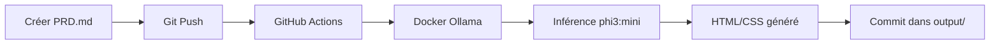

# 🤖 PRD to Website Generator

Système automatisé qui génère des sites web HTML/CSS à partir de fichiers PRD (Product Requirements Document) en utilisant Ollama et GitHub Actions.

## 📁 Structure du Projet

```
code-avec-remi/
├── .github/
│   └── workflows/
│       └── prd-to-website.yml    # Workflow GitHub Actions
├── docker/
│   └── ollama/
│       ├── Dockerfile            # Image Docker avec Ollama
│       └── start.sh              # Script de démarrage
├── prd/                          # Dossier pour vos fichiers PRD
│   └── exemple-site-portfolio.md
├── output/                       # Sites web générés (auto)
├── scripts/
│   └── generate_website.py      # Script de génération
└── README.md
```

## 🚀 Comment Utiliser

### 1. Créer un fichier PRD
Placez un fichier `.md` dans le dossier `prd/` avec vos spécifications:

```markdown
# PRD: Mon Site Web

## Objectif
Description de ce que vous voulez...

## Pages Requises
- Page 1: ...
- Page 2: ...

## Design
- Couleurs: ...
- Style: ...
```

### 2. Pousser sur GitHub
```bash
git add prd/mon-nouveau-site.md
git commit -m "Ajout PRD pour mon site"
git push
```

### 3. Attendre la génération
Les GitHub Actions se déclenchent automatiquement et:
1. Construisent le conteneur Docker avec Ollama
2. Téléchargent le modèle léger `phi3:mini` (~2GB)
3. Lisent votre PRD
4. Génèrent le code HTML/CSS via Ollama
5. Commit le résultat dans `output/`

### 4. Récupérer le résultat
Le fichier HTML généré sera disponible dans `output/mon-nouveau-site_generated.html`

## ⚙️ Configuration

### Modèle Ollama
Par défaut: `phi3:mini` (léger et rapide)

Pour changer, modifiez la variable `MODEL_NAME` dans:
- `docker/ollama/Dockerfile`
- `.github/workflows/prd-to-website.yml`

### Autres modèles disponibles:
- `phi3:mini` - ~2GB, très rapide (recommandé)
- `llama3.2:1b` - ~1.3GB, ultra léger
- `gemma2:2b` - ~1.6GB, bon compromis
- `mistral:7b` - ~4GB, plus puissant

## 🔧 Développement Local

Pour tester en local:

```bash
# 1. Construire l'image Docker
docker build -t ollama-custom ./docker/ollama

# 2. Lancer le conteneur
docker run -d -p 11434:11434 --name ollama-server ollama-custom

# 3. Attendre que le modèle soit prêt
curl http://localhost:11434/api/tags

# 4. Lancer le script Python
pip install requests
python scripts/generate_website.py
```

## 📝 Format du PRD

Un bon PRD pour la génération de site web doit inclure:

1. **Objectif** - Description claire du but
2. **Pages/Sections** - Structure du site
3. **Design** - Couleurs, polices, style
4. **Fonctionnalités** - Ce que le site doit faire
5. **Contenu** - Textes, images (placeholders)

Plus le PRD est détaillé, meilleure sera la génération!

## 🎯 Exemple de Workflow



## ⚠️ Notes Importantes

- **Temps de génération**: ~2-5 minutes selon la complexité
- **Taille du modèle**: phi3:mini fait ~2GB
- **Limites**: Le modèle léger peut simplifier certains designs complexes
- **Amélioration**: Vous pouvez itérer en modifiant le PRD et en re-poussant

## 📄 Licence

MIT
